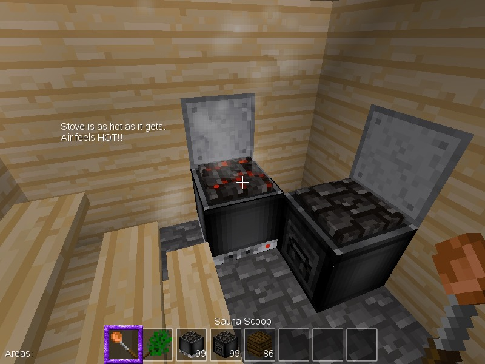
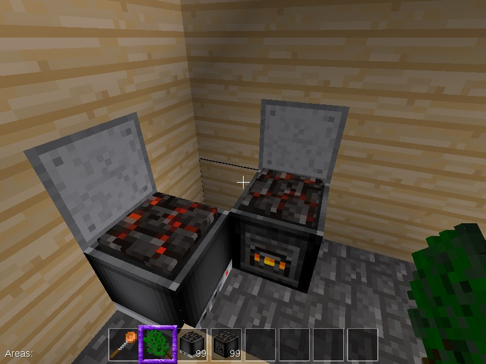

# Sauna

How does a game developed by a Finn not have sauna equipment? This mod fixes that problem. Included are:

* Wood-burning stove. Works as expected.
* Electric stove, using Technic MV. Right click to toggle on/off.
* Scoop for scooping water. This is essential to deliver the heat to the sauna goer.
* Vasta, a traditional bundle of leaves to whip yourself with.

Enjoying sauna has of course beneficial health effects. Too much is bad for you, though.

